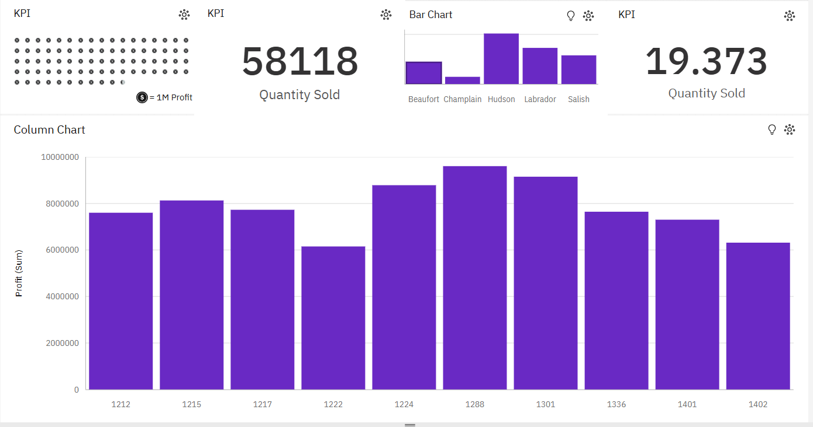
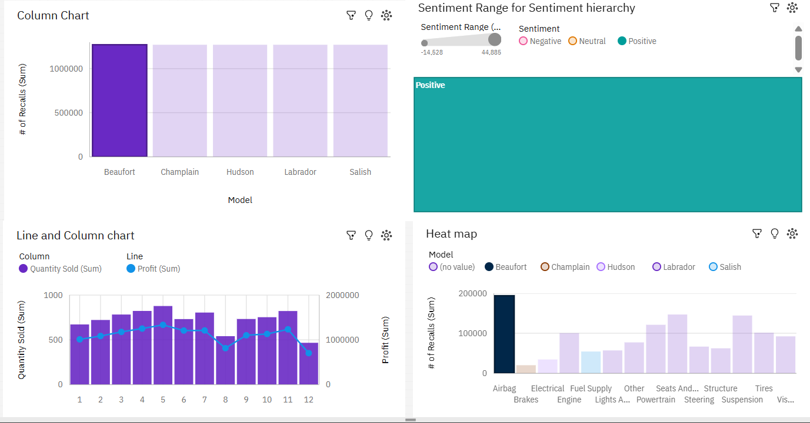
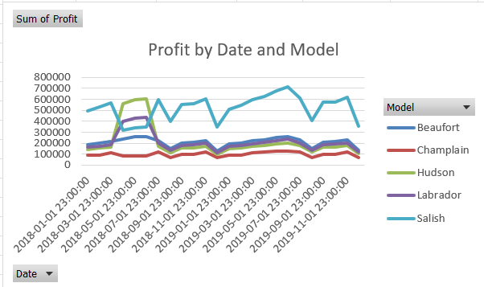
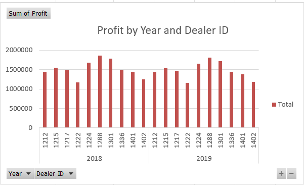
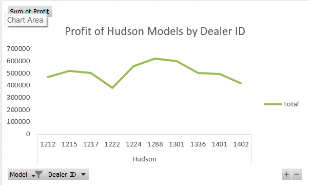
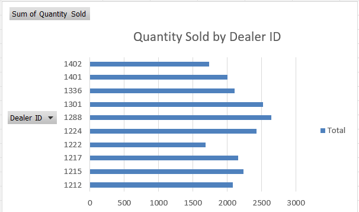

# IBM Data Analyst Professional Certificate — Data Visualization Coursework (Module 4)

## About
Two hands-on assignments completed for Module 4 of *Data Visualization and Dashboards with Excel and Cognos Analytics*, Course 3 of the IBM Data Analyst Professional Certificate (Coursera). Both use the same car dealership dataset — 5 models, 10 dealers, 24 months of sales and profit data — to practice visualizing the same numbers in two different tools.

## Projects
- [CarSalesByModelEnd.xlsx](./CarSalesByModelEnd.xlsx) — Completed Excel workbook with PivotTables and PivotCharts
- [Final_Assignment_Part2a.pdf](./Final_Assignment_Part2a.pdf) — IBM Cognos Analytics dashboard submission

## Screenshots

### Excel Dashboard

### Cognos Analytics Dashboard

### Charts

## Certificate
Course 3: Data Visualization and Dashboards with Excel and Cognos Analytics — IBM Data Analyst Professional Certificate
Credential ID:EK7W1W2UH9QS
